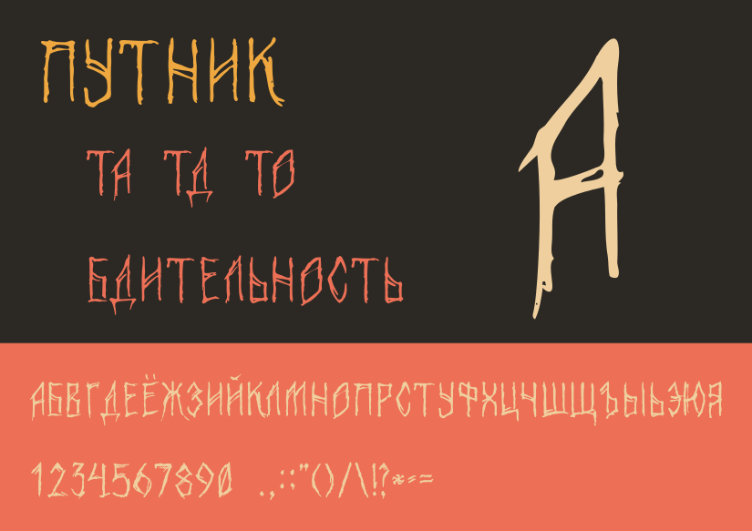

# Putnik Font

Putnik is rough condensed cyrillic display font. It is primarily inspired by runic script, early cyrillic script and wooden pagan inscriptions.
This font is non-professional, though.

Putnik was made especially for [short-movie by Ilya Osenev](https://www.youtube.com/watch?v=VteH0cZsxPg) with the same name.

Font is made with Inkscape and FontForge.

## Glyph set

Currently there's not too much glyphs. There is cyrillic (all caps), digits and incomplete set of punctuation.

## Todo's

- all punctuation
- better kerning
- glyph polishing and tweaking
- maybe latin-script
